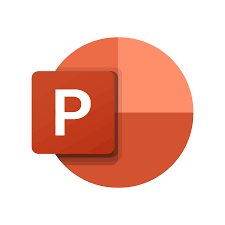

# 
    Microsoft-PowerPoint 

Microsoft PowerPoint is a program used for creating/editing and displaying graphic presentations, originally written for the Windows operating system and ported to the Mac OS X platform. The Windows version also works on Linux through the Wine compatibility layer.